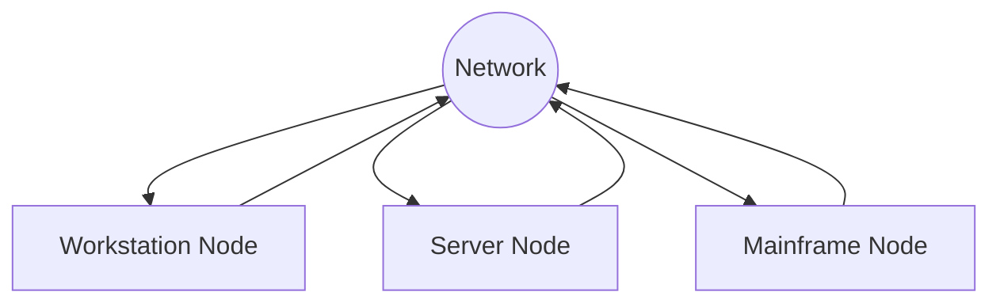

## Network
	Set of two or more computers connected togheter to share information.
	It is common to refer to each connected device as a node on the network to make a description applicable to a wide range of devices.

Each node maight have different OS or HW but as long as each node follows a set of rules or a network protocols, ir can communicate with other nodes in the network.

All nodes must understand the same Network Protocols.

## Network Protocols
- Maintaining sessions state
	- Implements mechanics to create a new connections and terminate existing connections.
- Identifying nodes througt addressing
	- Addressing mechanism to identify nodes or groups of nodes
- Controlling flow
	- The amount of data transferred across a network is limited
	- Reduce latency
- Guaranteeing the order of transmitted data
	- Many Networks do not guarantee that the order in which the data is sent will match the order in which it es received, and the protocol can reorder the data to ensure it is delivered in the correct orden
- Detecting and correcting errors
	- Data can become corrupted and it is important to detect the corruption and ideally correct it.
- Formatting and encoding data
	- Data is not always in a format suitable for transmitting on a network and a protocol can specify ways of encoding data.

